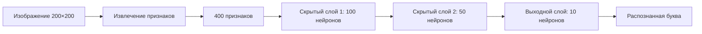
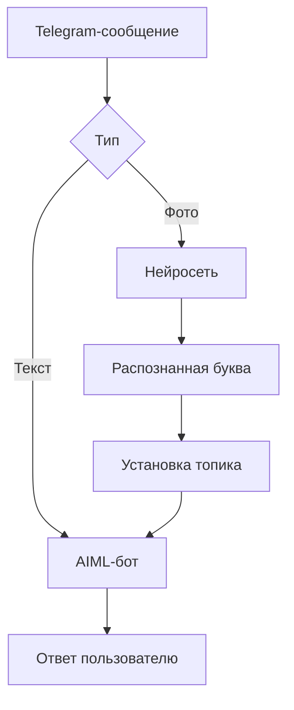

#  Распознавание букв азбуки Морзе + AIML-чат-бот для Telegram

> Интегрированная система распознавания образов и интеллектуального общения на основе AIML с Telegram-интерфейсом

[](https://dotnet.microsoft.com/)
[](https://core.telegram.org/bots)
[](https://en.wikipedia.org/wiki/AIML)

---

##  Содержание

- [Общее описание](#-общее-описание)
- [Ключевые возможности](#-ключевые-возможности)
- [Структура проекта](#-структура-проекта)
- [Архитектура](#-архитектура)
- [Установка и запуск](#-установка-и-запуск)
- [Использование](#-использование)
- [Примеры диалогов](#-примеры-диалогов)
- [Технические детали](#-технические-детали)
- [Скриншоты](#-скриншоты)
- [Команда разработки](#-команда-разработки)
- [Лицензия](#-лицензия)

---

##  Общее описание

Данный проект представляет собой интегрированную систему, объединяющую нейросетевое распознавание образов (букв кириллического алфавита, представленных в виде кодов азбуки Морзе) и интеллектуального чат-бота на основе AIML. Система реализована в виде десктопного приложения с графическим интерфейсом и Telegram-бота для удалённого взаимодействия.

Проект выполнен в рамках лабораторных работ по курсу, объединяя две темы:

- **Распознавание образов** — обучение нейросети распознаванию рукописных букв кириллицы
- **Чат-бот на AIML** — создание интеллектуального собеседника на языке AIML с поддержкой русского языка

---

##  Ключевые возможности

### 🧠 Нейросетевое распознавание
- **Две реализации нейросетей**:
  - Библиотечная — на основе **Accord.NET**
  - Самописная — с обратным распространением ошибки и моментом (momentum)
- **Распознавание 10 букв кириллицы**: `А, Г, Е, З, Н, П, Т, Ц, Ш, Ь`
- **Аугментация данных**: случайные сдвиги и масштабирование для увеличения обучающей выборки
- **Графический интерфейс** для обучения, тестирования и демонстрации

### 💬 AIML-чат-бот
- Поддержка **русского языка**
- Запоминание пользователей по имени
- Ведение контекстных диалогов через механизм `<topic>`
- Обработка синонимичных вопросов через `<srai>`
- Интеграция с нейросетью для обсуждения распознанных образов

### 📱 Telegram-бот
- Приём и распознавание изображений
- Интеллектуальное общение на основе AIML
- Запоминание контекста и последней распознанной буквы
- Обращение к пользователям по имени

---

## 📁 Структура проекта

```
NeuralNetwork1/
├── Form1.cs                    # Главная форма приложения
├── Form1.Designer.cs           # Дизайн главной формы
├── BaseNetwork.cs              # Абстрактный базовый класс нейросети
├── AccordNet.cs                # Реализация на Accord.NET
├── StudentNetwork.cs           # Самописная реализация нейросети
├── DatasetProcessor.cs         # Обработка датасета и извлечение признаков
├── Neural.cs                   # Классы Sample и SamplesSet
├── AIMLBotik.cs                # Обёртка над AIML-ботом
├── TLGBotik.cs                 # Telegram-бот с интеграцией
├── FastBitmap.cs              # Утилита для быстрой работы с пикселями
├── Program.cs                  # Точка входа
├── botkey.txt                  # Токен Telegram-бота (создаётся вручную)
└── dataset/                    # Директория с обучающими изображениями
    ├── А/
    ├── Г/
    ├── Е/
    ├── З/
    ├── Н/
    ├── П/
    ├── Т/
    ├── Ц/
    ├── Ш/
    └── Ь/
```

---

## 🏗 Архитектура

### Нейросетевая часть



- **Функция активации**: Сигмоида `σ(x) = 1/(1+e^(-x))`
- **Инициализация весов**: Xavier/Glorot
- **Оптимизация**: Градиентный спуск с моментом
- **Функция потерь**: Среднеквадратичная ошибка (MSE)

### Интеграция с AIML



---

## 🚀 Установка и запуск

### Требования

- **.NET Framework 4.7.2** или выше
- **Visual Studio 2019/2022** (или другая C# IDE)
- **Telegram Bot API Token** (для работы Telegram-бота)

### Настройка

1. **Клонирование репозитория**
   ```bash
   git clone https://github.com/yourusername/morse-recognition-bot.git
   cd morse-recognition-bot
   ```

2. **Установка зависимостей** (через NuGet Package Manager):
   ```
   Install-Package Accord.NET
   Install-Package Accord.Neuro
   Install-Package Telegram.Bot
   Install-Package Telegram.Bot.Extensions.Polling
   ```

3. **Настройка Telegram-бота**:
   - Создайте файл `botkey.txt` в корневой директории проекта
   - Поместите в него токен вашего Telegram-бота (получите у [@BotFather](https://t.me/BotFather))
   ```bash
   echo "ваш_токен_бота" > botkey.txt
   ```

4. **Подготовка датасета**:
   - Создайте папку `dataset` в корне проекта
   - Для каждой буквы создайте подпапку с названием буквы: `А\`, `Г\`, `Е\`, и т.д.
   - Поместите в каждую папку изображения (`*.jpg`, `*.jpeg`, `*.png`) соответствующей буквы
   - Минимальное количество: 20-30 изображений на букву

### Запуск

1. Откройте решение в **Visual Studio**
2. Соберите проект: `Build → Build Solution`
3. Запустите приложение: `Debug → Start Debugging` или нажмите `F5`

---

## 🎮 Использование

### Десктопное приложение

####  Обучение сети
| Шаг | Действие |
|-----|----------|
| 1 | Настройте параметры (размер выборки, количество эпох, целевая точность) |
| 2 | Выберите тип сети ("Accord.Net Perseptron" или "Student Network") |
| 3 | Нажмите кнопку **"Обучить"** |
| 4 | Наблюдайте за прогрессом на шкале прогресса и в статусной строке |

####  Тестирование
- Нажмите **"Тест"** для оценки точности на тестовой выборке
- Результат отобразится в статусной строке в процентах

####  Распознавание
- Кликните по изображению в левой части окна для загрузки случайного образца
- Результат распознавания отобразится на экране
- В правой части окна выводятся выходные значения нейросети для каждого класса

####  AIML-чат (локальный тест)
1. Введите сообщение в поле ввода в правой части окна
2. Нажмите кнопку **"Отправить"** или клавишу Enter
3. Ответ бота появится в поле вывода

### Telegram-бот

####  Запуск
1. В десктопном приложении нажмите **"Запустить бота"**
2. В поле для сообщений появятся логи работы бота
3. Бот готов к приёму сообщений

####  Взаимодействие
| Команда/Действие | Описание |
|------------------|----------|
| `/start` | Приветствие и краткая информация о боте |
| Текстовое сообщение | Общение через AIML-бота |
| 📷 Фото | Распознавание буквы на изображении |
| Вопрос о букве | Бот отвечает на основе контекста |

---

##  Примеры диалогов

###  Приветствие
```
👤 Пользователь: Привет!
🤖 Бот: Здравствуйте! Я бот, который умеет распознавать буквы русского алфавита 
в коде Морзе. Отправьте мне фотографию с рукописной буквой, 
и я постараюсь её распознать!
```

###  Распознавание
```
👤 Пользователь: [отправляет фото буквы А]
🤖 Бот: 🔍 Алексей, я распознал букву А (·−)!
Это точка и тире. Хочешь узнать что-нибудь интересное об этой букве?

👤 Пользователь: Расскажи о ней подробнее
🤖 Бот: Буква А — первая буква русского алфавита! 
В кириллице она произошла от греческой буквы альфа. 
А в азбуке Морзе её код — это точка и тире, 
что делает её одной из самых узнаваемых.
```

###  Контекстная беседа
```
👤 Пользователь: Расскажи о букве Ш
🤖 Бот: 🔍 Это буква Ш (−−−−)! 
Четыре тире — самый длинный код! Хочешь факт?

👤 Пользователь: А что ты о ней знаешь?
🤖 Бот: Буква Ш — одна из самых интересных букв кириллицы! 
В древности она обозначала звук, похожий на современный 'ш'. 
Интересно, что в английском языке нет точного аналога этому звуку, 
поэтому изучение русского языка часто начинают с этой буквы.
```

###  Смена темы
```
👤 Пользователь: Расскажи о букве Г
🤖 Бот: 🔍 Алексей, это буква Г (−−·)!
Два тире и точка. Спроси меня подробнее!

👤 Пользователь: А теперь расскажи о чём-нибудь другом
🤖 Бот: Буква Г — третья буква русского алфавита... 
```

---

##  Технические детали

###  Извлечение признаков

Признаки формируются путём подсчёта чёрных пикселей в каждой строке и каждом столбце изображения размером 200×200 пикселей:

```csharp
// Горизонтальные проекции (200 признаков)
for (int x = 0; x < ImageSize; x++)
{
    int count = 0;
    for (int y = 0; y < ImageSize; y++)
        if (пиксель_чёрный) count++;
    input[x] = count / (double)ImageSize;
}

// Вертикальные проекции (200 признаков)
for (int y = 0; y < ImageSize; y++)
{
    int count = 0;
    for (int x = 0; x < ImageSize; x++)
        if (пиксель_чёрный) count++;
    input[ImageSize + y] = count / (double)ImageSize;
}
```

###  Аугментация данных

Для увеличения обучающей выборки применяются случайные преобразования:
- Сдвиг: ±10 пикселей по X и Y
- Масштабирование: 0.9x — 1.1x

###  Интеграция AIML

AIML-бот использует:
- **Переменные** для хранения имени пользователя и текущего топика
- **Механизм `<srai>`** для обработки синонимичных вопросов
- **Паттерны** на русском языке для естественного общения
- **Топики** для контекстной беседы о распознанных буквах

###  Параллельные вычисления

Самописная нейросеть поддерживает параллельные вычисления через `Parallel.For`:
- Прямое распространение по нейронам слоя
- Обратное распространение ошибки
- Обновление весов

---

##  Скриншоты

### Главное окно приложения
```
┌─────────────────────────────────────────────────────────────────────────────┐
│  📷 Распознавание букв азбуки Морзе + AIML чат-бот                        │
├──────────────────────────┬──────────────────────────────────────────────────┤
│                          │  Кликните на картинку для распознавания         │
│                          │                                                  │
│      [Изображение]       │  ┌──────────────────────────────────────────┐   │
│                          │  │  Параметры сети                         │   │
│                          │  │  [Accord.Net Perseptron ▼]              │   │
│                          │  │  Структура: 400;100;50;10              │   │
│                          │  │  Размер выборки: [2000]                │   │
│                          │  │  Эпохи: [100]                          │   │
│                          │  │  Классов: [10]                         │   │
│                          │  │  Точность: [=========>-------] 80%     │   │
│                          │  │  [x] Параллельный расчёт               │   │
│                          │  │  [Обучить] [Тест]                      │   │
│                          │  └──────────────────────────────────────────┘   │
│                          │                                                  │
│                          │  Выходы сети:                                   │
│                          │  А: 0.987                                       │
│                          │  Г: 0.001                                       │
│                          │  Е: 0.002                                       │
│                          │  ...                                           │
├──────────┬───────────────┴──────────────────────────────────────────────────┤
│ Статус   │ ████████████████████████████████░░░░░░░░ 78%                     │
│ Время:   │ 00:01:23:45                                                     │
│ Ошибка:  │ 0.000234                                                        │
├──────────┴──────────────────────────────────────────────────────────────────┤
│  Status: Готово к работе. Обучите сеть.                                  │
└─────────────────────────────────────────────────────────────────────────────┘
```

### Чат-бот в Telegram
```
📱 Telegram

[Алексей] Привет!
[Бот] Здравствуйте, Алексей! 🖐️
      Я умею распознавать буквы русского алфавита в коде Морзе.
      Отправьте мне фото рукописной буквы!

[Алексей] [📷 фото буквы А]
[Бот] 🔍 Алексей, я распознал букву А (·−)!
      Это точка и тире. Хочешь узнать что-нибудь интересное об этой букве?

[Алексей] Расскажи о ней подробнее
[Бот] Буква А — первая буква русского алфавита!
      В кириллице она произошла от греческой буквы альфа...
```

---


##  Лицензия

Проект предназначен для образовательных целей. Все права защищены.

---


> ⚡ **Примечание**: Для работы Telegram-бота необходимо, чтобы десктопное приложение было запущено. Бот использует локальный экземпляр AIML и нейросети.
